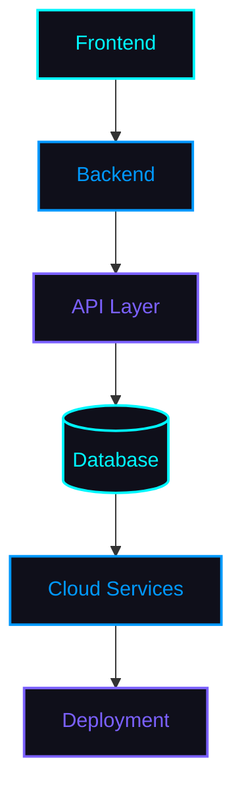

 

 

## 🧠 About Me

I'm a software developer working across **backend engineering**, **artificial intelligence**, and **automation** — building systems that are reliable under real conditions, not just in a demo environment.

My interests center on:

- **Backend Development** — designing services that stay stable under load and edge cases
- **Artificial Intelligence** — integrating AI into practical, everyday tooling
- **Automation** — removing repetitive work from workflows and infrastructure
- **Cybersecurity** — understanding systems well enough to know how they break
- **Problem Solving** — favoring root-cause fixes over patchwork solutions
- **Scalable Applications** — architecture that holds up as usage grows

I care about the details most users never see: race conditions, reconnect logic, clean state transitions — the parts of software that determine whether something *actually* works, or just appears to.

 

## 💡 What I Work With

I build primarily with **Python**, **JavaScript**, and **Flask**, backed by **Supabase** for data and auth, across both web and desktop targets. My work spans modern web development, automation scripting, AI-integrated applications, and native desktop software — with deployment handled through cloud platforms suited to each project's scale.

I maintain an active interest in **open source**, contribute to and build my own tooling, and prioritize clean, maintainable code over quick fixes. Recent focus areas include AI-assisted applications, DSP-heavy desktop software, and backend systems designed to run unattended for long periods without manual intervention.

---

## 🚧 Current Projects

<table>
<tr>
<td width="50%">

### 🛡 Phoenix Antivirus
AI-powered desktop antivirus focused on behavioral threat detection rather than static signatures.

</td>
<td width="50%">

### 🎤 PhoenixMic
Real-time microphone enhancement software with a full DSP effects chain and licensing system.

</td>
</tr>
<tr>
<td width="50%">

### 🤖 Discord Voice Manager
Voice channel management bot with state-machine-driven reliability and automated deployment.

</td>
<td width="50%">

### 🚗 Smart Parking System
Vehicle and parking management platform built on Supabase with a modern web interface.

</td>
</tr>
<tr>
<td width="50%">

### 🏥 Hospital Analytics Dashboard
Interactive healthcare analytics dashboard with live reporting and data visualization.

</td>
<td width="50%">

### 🎓 AI Scholarship Finder
AI-driven platform that matches students to scholarships based on eligibility data.

</td>
</tr>
<tr>
<td width="50%">

### 🚑 Emergency Route Optimizer
Smart routing system built on modern mapping technologies to reduce response time.

</td>
<td width="50%">

### ➕ More in Progress
New projects are actively in development — check back for updates.

</td>
</tr>
</table>

---

## 🔥 Phoenix Ecosystem

| Product | Description |
|---|---|
| 🛡 **Phoenix Antivirus** | Modern AI-powered desktop antivirus built around behavioral detection and threat intelligence. |
| 🎤 **PhoenixMic** | Professional microphone enhancement software with a real-time DSP chain and licensing system. |
| 🤖 **Discord VC Server Bot** | Advanced Discord voice channel bot with automation, state management, and deployment support. |
| 🏥 **Hospital Analytics Dashboard** | Healthcare analytics dashboard with interactive reporting and role-based data views. |
| 🚗 **Smart Parking Management** | Vehicle management platform built on Supabase with a responsive web front end. |
| 🎓 **AI Scholarship Finder** | AI-powered scholarship matching platform for students. |
| 🚑 **Emergency Route Optimizer** | Smart routing system for minimizing emergency response times. |
| 📊 **Business Analytics Dashboard** | Data visualization and reporting platform for operational business metrics. |
| 🧪 **Future AI Products** | New AI-driven tools currently in research and development. |

---

## 🧰 Services

<table>
<tr>
<td width="33%" align="center">

**Development**
 
Full Stack Development
 
Backend Development
 
Python Development
 
Desktop Applications

</td>
<td width="33%" align="center">

**AI & Data**
 
AI Integration
 
REST API Development
 
Database Design
 
Supabase Development

</td>
<td width="33%" align="center">

**Delivery**
 
Automation
 
UI/UX Development
 
Deployment
 
Technical Consulting

</td>
</tr>
</table>

---

## 🔗 Connect

---

## 🧪 Technology Stack

**Languages**
 

  

**Frameworks**
 

  

**Databases**
 

  

**Tools & Platforms**
 

---

## 🏗 Development Architecture

---

## 📊 GitHub Analytics

 

 

 

### 📅 Contribution Calendar

### 🐍 Contribution Snake

Requires the <a href="https://github.com/Platane/snk">Platane/snk</a> GitHub Action configured on this profile repo.

### 🏆 Trophies

---

## 💬 Discord Community

**Founder of Heaven Society**

A developer community built around shared learning and real projects.

Inside Heaven Society, you'll find:

- 👥 **Developer Community** — devs across all skill levels
- 💻 **Programming Discussions** — architecture, debugging, best practices
- 🚀 **Project Showcase** — share what you're building and get feedback
- 🛠 **Coding Support** — get unstuck faster
- 🌍 **Open Source** — collaborate on public repos
- 📚 **Learning Together** — resources and study groups
- 📢 **Server Updates** — announcements and roadmap changes
- 🎉 **Community Events** — challenges, sessions, and meetups

**[Join Heaven Society →](https://discord.gg/Uxgh2RNJtD)**

---

## 🎵 Now Playing

<!-- Spotify widget placeholder — connect via spotify-github-profile to enable live status -->

Live Spotify status not currently connected. Set up via <a href="https://github.com/kittinan/spotify-github-profile">spotify-github-profile</a> to enable this widget.

---

## 🤝 Support / Contact

Open to collaborating on:

**Freelance Projects** · **Open Source** · **Internships** · **Developer Collaborations** · **Technical Discussions** · **AI Projects** · **Business Enquiries**

---

### 📈 Visitors & Stats

  

Tamil Nadu, India — building software that holds up under real conditions.

