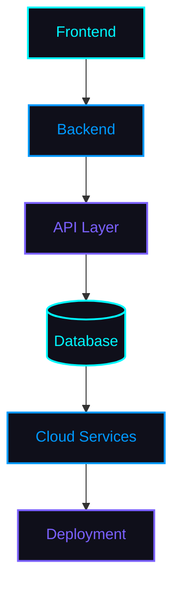

 

 

## 🧠 About Me
I specialize in building modern software across web, desktop, and cloud platforms.

* 🛠️ Building reliable software for web, desktop, and cloud platforms
* 🧠 Exploring **Artificial Intelligence**, **Cybersecurity**, and automation
* ⚡ Passionate about clean architecture and efficient backend systems
* 🔍 Enjoy solving complex technical challenges through practical development
* 📚 Constantly learning, experimenting, and building new products

 

## 🚀 Products & Projects

| Product                              | Overview                                                                                                                           |       Status      |
| :----------------------------------- | :--------------------------------------------------------------------------------------------------------------------------------- | :---------------: |
| 🛡 **Phoenix Antivirus**             | AI-powered desktop antivirus focused on intelligent threat detection, modern security architecture, and real-time protection.      |    🚧 Active |
| 🎤 **PhoenixMic**                    | Desktop microphone enhancement software featuring real-time DSP audio effects, preset management, and a secure licensing system.   | ✅ Completed |
| 🤖 **Discord Voice Manager**         | Automation bot for Discord voice channels with reliable state management and server deployment support.                            |     🚧 Active     |
| 🚗 **Smart Parking Management**      | Web-based parking management platform built with Supabase, featuring vehicle tracking, token management, and real-time operations. |    ✅ Completed    |
| 🏥 **Hospital Analytics Dashboard**  | Interactive analytics dashboard for healthcare data visualization, reporting, and operational insights.                            |     🚧 Active     |
| 🎓 **AI Scholarship Finder**         | AI-assisted platform that helps students discover scholarships based on eligibility and academic information.                      |     🚧 Active     |
| 🚑 **Emergency Route Optimizer**     | Intelligent route optimization system designed to improve emergency response through efficient path planning.                      |     💡 Concept    |
| 🛠 **Discord Server Management Bot** | Comprehensive moderation and server management bot with role automation, logging, utility commands, and configurable settings.     | 🚧 In Development |
| ⚡ **More Coming Soon**               | Continuously building new AI, cybersecurity, automation, productivity, and Discord-based software solutions.                       |     🔄 Ongoing    |

---

### 📊Contribution Board     
 

---
## 🧰 Services

<table>
<tr>
<td width="33%" align="center">

**Development**
 
Full Stack Development
 
Backend Development
 
Python Development
 
Desktop Applications

</td>
<td width="33%" align="center">

**AI & Data**
 
AI Integration
 
REST API Development
 
Database Design
 
Supabase Development

</td>
<td width="33%" align="center">

**Delivery**
 
Automation
 
UI/UX Development
 
Deployment
 
Technical Consulting

</td>
</tr>
</table>

---

## 🔗 Connect

---

## 🧪 Technology Stack

**Languages**
 

  

**Frameworks**
 

  

**Databases**
 

  

**Tools & Platforms**
 

---

## 🏗 Development Architecture

---

## 📊 GitHub Analytics

 

 

 

---

## 💬 Discord Community

**Founder of Heaven Society**

A developer community built around shared learning and real projects.

Inside Heaven Society, you'll find:

- 👥 **Developer Community** — devs across all skill levels
- 💻 **Programming Discussions** — architecture, debugging, best practices
- 🚀 **Project Showcase** — share what you're building and get feedback
- 🛠 **Coding Support** — get unstuck faster
- 🌍 **Open Source** — collaborate on public repos
- 📚 **Learning Together** — resources and study groups
- 📢 **Server Updates** — announcements and roadmap changes
- 🎉 **Community Events** — challenges, sessions, and meetups

**[Join Heaven Society →](https://discord.gg/Uxgh2RNJtD)**

---

## 🤝 Support / Contact

Open to collaborating on:

**Freelance Projects** · **Open Source** · **Internships** · **Developer Collaborations** · **Technical Discussions** · **AI Projects** · **Business Enquiries**

---

### 📈 Visitors & Stats

  

Tamil Nadu, India — building software that holds up under real conditions.

